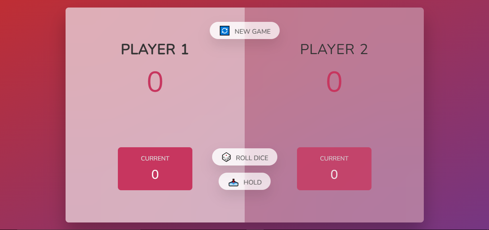
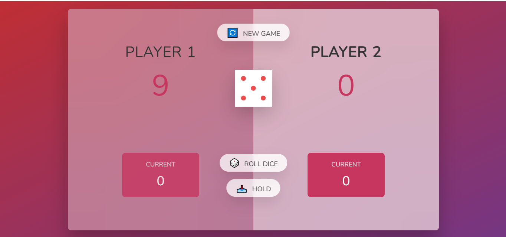

# Pig Game

## Description

The Pig Game is a simple two-player dice game where players take turns rolling a die to accumulate points. The goal is to be the first player to reach 100 points.

## Installation/Setup

1. Clone the repository:
   ```bash
   git clone https://github.com/Jatinsharma43/pig-game.git
   ```
2. Navigate to the project directory:
   ```bash
   cd js-6
   ```
3. Open `6.html` in your browser to play the game.

## How to Play

- The game is played between two players.
- On your turn, you can roll the die as many times as you want.
- Each roll adds to your current score.
- If you roll a 1, you lose all points accumulated in that turn and your turn ends.
- You can choose to "Hold" your current score, adding it to your total score and ending your turn.
- The first player to reach 100 points wins the game.

## Technologies Used

- HTML
- CSS
- JavaScript

## Knowledge Gained

This project helped in understanding:

- DOM manipulation
- Event handling
- Game logic implementation
- State management in JavaScript

## screnshots



